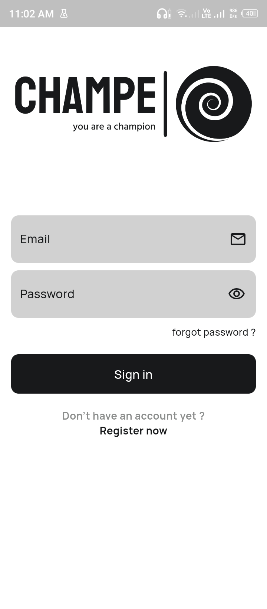
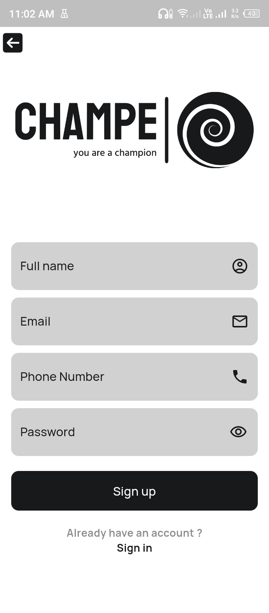

# 🔖CHAMPE

### Your personal safe haven, right in your pocket. Download the Champe app.

Champe is a revolutionary mobile app designed to provide accessible and personalized
mental health support. Champe is a Kenyan slang term derived from "champion," 
Champe symbolizes a personal guide and supporter on your journey to well-being.

## Project Screenshots

**Here's a glimpse of what this project offers:**

| Splash Screen                            | Landing Page                             | SignIn Page                              | SignUp Page                              | Forgot Password Page                     |
|------------------------------------------|------------------------------------------|------------------------------------------|------------------------------------------|------------------------------------------|
|  |  |  |  |  |

| Home Page                                | Messages Page                            | Therapist Page                           | AI CHAT BOT (LINDA) Page                 | Therapist List Page                        |
|------------------------------------------|------------------------------------------|------------------------------------------|------------------------------------------|--------------------------------------------|
|  |  |  |  |  |

| Therapist Details Page                     | Schedule Booking Page                      | Schedule Booking Confirm Toast             | Bookings Upcoming Page                     | Bookings Complete Page                     |
|--------------------------------------------|--------------------------------------------|--------------------------------------------|--------------------------------------------|--------------------------------------------|
|  |  |  |  |  |

| Booking Cancel Page                        | Bookmark Page                              | Profile Page                               | Statistics Page                            | Statistics Page                            |
|--------------------------------------------|--------------------------------------------|--------------------------------------------|--------------------------------------------|--------------------------------------------|
|  |  |  |  |  |

## Key Challenges Identified

- **Limited Access:** A significant portion of the population, including youth, 
women, vulnerable groups, and the general population, lack access to mental health care.
- **Lack of Mental Health Education:** There is a deficiency in mental health education, 
leading to a lack of understanding, awareness, and stigma reduction.
- **High Cost of Therapy:** The cost of professional therapy is prohibitive for many 
individuals, limiting their ability to seek help.
- **Fear of Stigma:** The fear of social stigma associated with mental health issues 
prevents many people from seeking treatment.

## Potential Root Causes

- **Inadequate infrastructure:** Limited availability of mental health professionals and 
facilities, especially in rural areas.
- **Cultural barriers:** Societal stigma and negative attitudes towards mental health.
- **Economic constraints:** High cost of living and limited access to healthcare insurance.
- **Lack of awareness and understanding:** Insufficient education and information about 
mental health.

## Potential Impact

- **Increased prevalence of mental health disorders:** Untreated mental health conditions 
can worsen over time, leading to increased suffering and disability.
- **Reduced productivity and economic loss:** Mental health issues can affect individuals' 
ability to work and participate fully in society.
- **Social isolation and strained relationships:** Mental health problems can lead to social withdrawal and difficulties in maintaining relationships.

## Proposed Solutions

Given the identified challenges in mental health care access in Kenya, Champe can offer several innovative solutions:

### 1. Leverage Technology for Accessibility:
   - **Remote Access:** Champe's app-based platform ensures accessibility from anywhere, 
   breaking down geographical barriers.
   - **Offline Mode:** Enable offline functionality for users in areas with limited 
   internet connectivity.
### 2. Promote Mental Health Education:
   - **Integrated Educational Content:** Incorporate articles, videos, and quizzes to 
   educate users about mental health conditions, coping mechanisms, and self-care strategies.
   - **Community Engagement:** Facilitate online communities or support groups where users can share experiences and learn from others.
### 3. Reduce Cost Barriers:
   - **Tiered Pricing:** Offer different subscription plans to accommodate various budgets.
   - **Partnerships with Healthcare Providers:** Collaborate with healthcare providers to 
   offer bundled services or discounts.
   - **24/7 Chatbot Support (Linda):** Introduce a free 24/7 chatbot named Linda to provide 
   basic mental health support, information, and resources. Linda can serve as a 
   first point of contact, offering immediate assistance and reducing the need for 
   costly therapy sessions in all cases.
### 4. Address Stigma and Promote Acceptance:
   - **Anonymous and Confidential Services:** Ensure user privacy and confidentiality to 
   reduce the fear of stigma.
   - **Success Stories:** Share positive stories of individuals who have benefited from 
   mental health support to challenge negative stereotypes.
   - **Educate Healthcare Professionals:** Collaborate with healthcare providers to raise 
   awareness about mental health and reduce stigma within the medical community.

## Key Features

- **AI-powered chatbot:** 24/7 support, answering questions, offering guidance, and 
providing helpful tips. Our chatbot is designed to be empathetic, understanding, and 
responsive, offering a sense of companionship and support.
- **Personalized mental health assessments:** Tailored support strategies based on 
your unique needs. Champe uses advanced algorithms to analyze your responses and 
provide personalized recommendations, ensuring that the support you receive is 
relevant and effective.
- **Therapist scheduling:** Seamlessly connect with qualified therapists. Champe simplifies 
the process of finding a suitable therapist by connecting you with professionals in 
your area who specialize in various mental health conditions.

